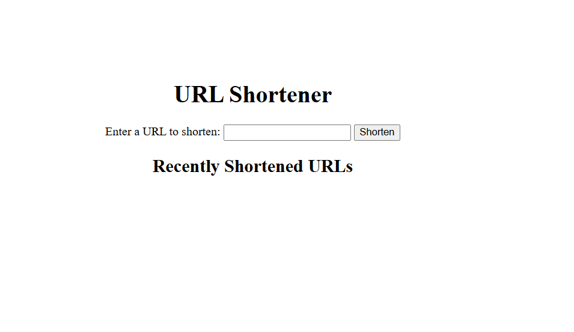

```markdown
# URL Shortener

A simple and efficient URL Shortener built with Node.js and Express.js. This application allows users to generate shortened URLs for easy sharing and redirection to the original long URLs.

## Features
- Shorten any valid URL with a randomly generated 6-character shortcode.
- Redirect shortened URLs to their original destinations.
- View a list of recently shortened URLs on the homepage.

## Live Demo
Access the live app here: [URL-Shortner-Service](https://url-shortner-service-wnwl.onrender.com)



## Technologies Used
- **Backend:** Node.js, Express.js
- **Templating Engine:** EJS
- **Frontend:** HTML, CSS
- **Validation:** `valid-url` package

## How It Works
1. Enter a valid URL into the input field on the homepage.
2. Click the "Shorten" button to generate a shortened URL.
3. Use the shortened URL to redirect back to the original URL.

## Installation
Follow these steps to run the project locally:

### Prerequisites
- Node.js installed on your system
- A package manager like npm or yarn

### Steps
1. Clone the repository:
   ```bash
   git clone https://github.com/dhokabeatz/URL-Shortner.git
   cd url-shortener
   ```

2. Install dependencies:
   ```bash
   npm install
   ```

3. Start the server:
   ```bash
   npm start
   ```

4. Open your browser and go to `http://localhost:3000`.

## Project Structure
```
URL-Shortener/
├── controllers/         # Logic for handling routes
│   └── urlController.js
├── models/              # In-memory database for URL mappings
│   └── urlModel.js
├── views/               # EJS templates
│   └── index.ejs
├── public/              # Static files (if any)
├── app.js               # Main application entry point
├── package.json         # Project metadata and dependencies
└── README.md            # Project documentation
```


## Contributing
Contributions are welcome! Feel free to:
- Fork the repository
- Create a new branch for your feature
- Submit a pull request

## License
This project is licensed under the MIT License. See the [LICENSE](LICENSE) file for details.

## Author
Created by [Henry Agyemang](https:www.linkedin.com/in/dhokabeatz). Follow me on [Twitter](https://twitter.com/dhokabeatz) for updates and more projects.

---

Feel free to reach out if you encounter any issues or have suggestions for improvement especially in the frontend😂!
```
